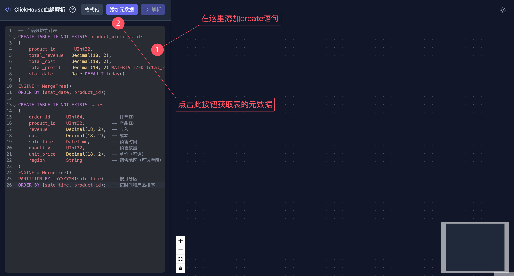
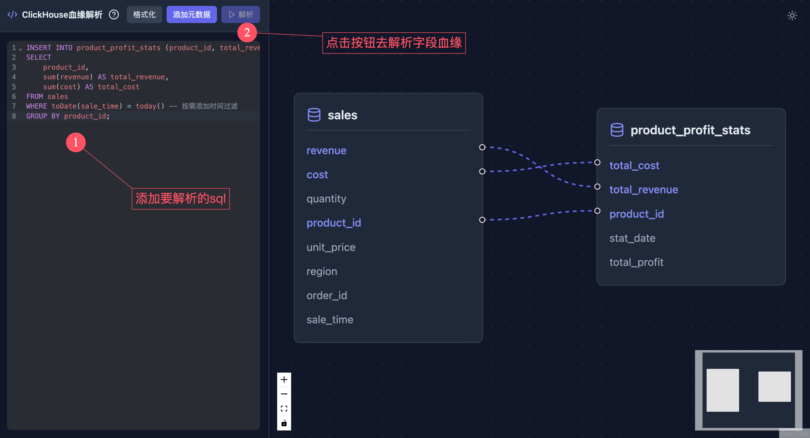

# clickhouse-sql-lineage

通过antlr解析ClickHouse SQL的列级血缘

## 使用

针对下面的sql语句

```clickhouse
INSERT INTO product_profit_stats (product_id, total_revenue, total_cost)
SELECT product_id,
       sum(revenue) AS total_revenue,
       sum(cost)    AS total_cost
FROM sales
WHERE toDate(sale_time) = today() -- 按需添加时间过滤
GROUP BY product_id;
```

通过解析create语句获取表元数据

```java
import java.util.List;

String createSqlList = """
        -- 产品效益统计表
        CREATE TABLE IF NOT EXISTS product_profit_stats
        (
            product_id       UInt32,
            total_revenue   Decimal(18, 2),
            total_cost      Decimal(18, 2),
            total_profit    Decimal(18, 2) MATERIALIZED total_revenue - total_cost,
            stat_date       Date DEFAULT today()
        )
        ENGINE = MergeTree()
        ORDER BY (stat_date, product_id);
        
        CREATE TABLE IF NOT EXISTS sales
        (
            order_id      UInt64,          -- 订单ID
            product_id    UInt32,          -- 产品ID
            revenue       Decimal(18, 2),  -- 收入
            cost          Decimal(18, 2),  -- 成本
            sale_time     DateTime,        -- 销售时间
            quantity      UInt32,          -- 销售数量
            unit_price    Decimal(18, 2),  -- 单价（可选）
            region        String           -- 销售地区（可选字段）
        )
        ENGINE = MergeTree()
        PARTITION BY toYYYYMM(sale_time)   -- 按月分区
        ORDER BY (sale_time, product_id);  -- 按时间和产品排序
        """;
List<TableMeta> tableMetaList = ClickHouseLineageParser.parseDdl(createSqlList);
```

调用[ClickHouseLineageParser.java](lineage-parser/src/main/java/com/sin/lineage/parser/ClickHouseLineageParser.java)的
`parseColumnLineage`方法进行解析

```java
String sql = """
        INSERT INTO
            product_profit_stats (product_id, total_revenue, total_cost)
        SELECT
            product_id,
            sum(revenue) AS total_revenue,
            sum(cost) AS total_cost
        FROM
            sales
        WHERE
            toDate(sale_time) = today() -- 按需添加时间过滤
        GROUP BY
            product_id;
        """;

// 获取表元数据
List<TableMeta> tableMetaList = ClickHouseLineageParser.parseDdl(createSqlList);
// 解析字段血缘
List<List<Node>> lineage = ClickHouseLineageParser.parseColumnLineage(sql, tableMetaList);
```

解析出的血缘结果如下：

```shell
sales.product_id  -> stmt0.product_id    -> product_profit_stats.product_id
sales.revenue     -> stmt0.total_revenue -> product_profit_stats.total_revenue
sales.cost        -> stmt0.total_cost    -> product_profit_stats.total_cost
```

> 更多解析示例，参考[lineage-parser](lineage-parser)模块中的测试用例。

## 构建和部署

先决条件：

- Java 17
- maven

```shell
git clone https://github.com/oyesin/clickhouse-sql-lineage.git
cd clickhouse-sql-lineage
mvn clean package
```

启动后端服务:
运行[LineageServerApplication.java](lineage-server/src/main/java/com/sin/lineage/server/LineageServerApplication.java)

启动前端服务:

> 前端构建可参考[README.md](lineage-web/README.md)

```shell
cd lineage-web

# 安装依赖
pnpm install

# 启动开发服务器
pnpm dev

# 构建生产版本
pnpm build
```

访问[http://localhost:5173/](http://localhost:5173/)




